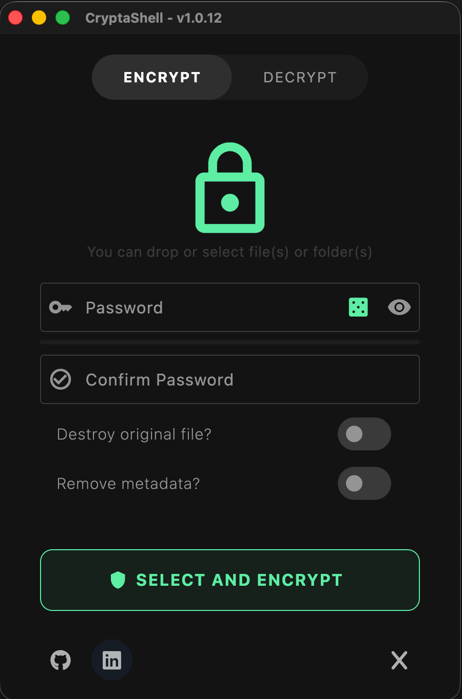
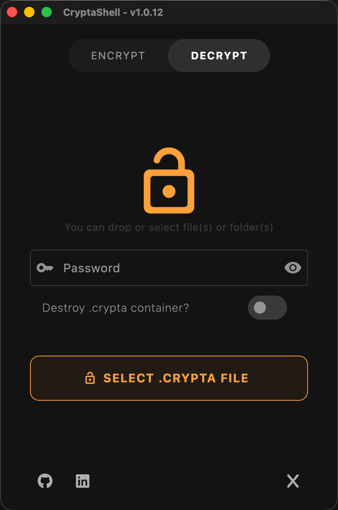
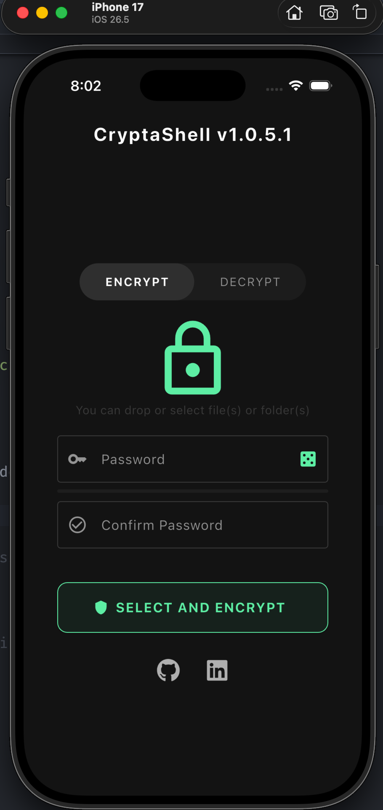

# 🛡️ CryptaShell

> A High-Security, Cross-Platform Cryptographic File Management System built with Dart/Flutter. (A project that is still under development).

CryptaShell is an offline-first desktop and mobile application designed to securely encrypt and decrypt files and complete directory trees. It acts as a digital bunker, prioritizing strict *Privacy-by-Design* principles, robust memory hygiene, and native-feeling user interfaces.

---

## ✨ Key Features

* **Military-Grade Cryptography:** Utilizes Authenticated Encryption (AES-256-GCM) to ensure both absolute confidentiality and protection against malicious file tampering.
* **CryptaArchive Containers:** Compresses and packages multiple files and complex directory structures into a single, clean `.crypta` vault before encryption, preventing directory bloat.
* **Zero-Knowledge Architecture:** Fully offline. No telemetry, no cloud backups, no backdoors. Your keys never leave your local device.
* **Cross-Platform:** Beautiful, responsive UI tailored for macOS, iOS, Android, Windows, and Linux.
* **macOS-Style Workflow:** Drag-and-drop support and intelligent file naming conventions.

---

| Encrypt (macOS) | Decrypt (macOS) | iPhone 17 |
| :---: | :---: | :---: |
|  |  |  |

## 🏗️ Technical Architecture

The codebase strictly follows **Clean Architecture** principles, decoupling business rules from UI and external frameworks, ensuring a highly testable and maintainable environment.

* **State Management:** Reactive and predictable UI states using the **BLoC** (Business Logic Component) pattern.
* **Dependency Injection:** Centralized service locator pattern using `get_it` for reliable constructor injection.
* **Functional Error Handling:** Utilizing `fpdart` (`Either<Failure, File>`) in the Domain layer Use Cases to eliminate unpredictable `try-catch` blocks in the presentation layer.
* **Atomic Persistence:** Disk write operations utilize hardware flush commands to prevent file corruption during power loss or abrupt OS termination.

---

## 🔒 Security Deep Dive

CryptaShell does not cut corners on security implementations. It mitigates both external cryptographic attacks and internal OS-level memory leaks:

1. **High-Strength Key Derivation (KDF):**
   User passwords are not hashed directly. We configure `Pbkdf2` with `Hmac.sha256` and **600,000 iterations**, exceeding current OWASP recommendations. This mathematically nullifies the viability of brute-force or rainbow table attacks.
2. **Authenticated Encryption (AES-GCM):**
   The `.crypta` file structure includes a randomly generated 16-byte Salt, a 12-byte Nonce, the CipherText, and a 16-byte MAC Tag. If a single byte is altered on the storage drive, the decryption process fails immediately, protecting against Padding Oracle attacks.
3. **Strict RAM Hygiene (Zeroing):**
   To prevent keys from lingering in the OS Garbage Collector (Heap), sensitive strings are immediately converted to mutable byte arrays (`Uint8List`). Upon completion of the cryptographic operation, buffers are manually destroyed using `.fillRange(0)`, leaving no trace for memory dump attacks.

---

## 🚀 Getting Started

### Prerequisites
* Flutter SDK (>=3.0.0)
* Dart SDK
* Platform-specific toolchains (Xcode for macOS/iOS, Android Studio, Visual Studio for Windows).

### Installation

1. Clone the repository:
   ```bash
   git clone [https://github.com/yourusername/crypta_shell.git](https://github.com/arnabau/cryptashell.git)
   cd crypta_shell

2. Install dependencies:
    ```bash
    flutter pub get

3. Generate platform icons (Optional, requires flutter_launcher_icons):
    ```bash
    flutter pub run flutter_launcher_icons

4. Run the application:
    ```bash
    flutter run -d macos  # or your preferred target device

### 🛠️ Tech Stack & Dependencies
* flutter_bloc & equatable - Presentation Layer
* get_it - Dependency Injection
* fpdart - Functional Programming (Either monad)
* cryptography - Core AES-GCM and PBKDF2 implementation
* archive - In-memory ZIP containerization
* desktop_drop & file_picker - Cross-platform file handling

---

Your suggestions or bug reports are welcome. You're also welcome to collaborate on the project.

## Do you like CryptaShell? Do you found it helpful?

I maintain this project in my free time. Any support is very welcome:

<a href="https://buymeacoffee.com/stringsandbits" target="_blank">
  
</a>
